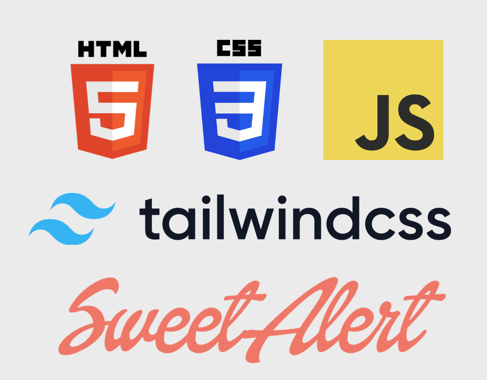

# Helping Hand

### Website Description:

This App was inspired by our desire to better our community. Its intent is to connect volunteers to nearby charities. Based on user input the site will return a list of local charities that includes name, address, website and category.

<br>

### Deployed Site:

[Deploy-Link](https://pbarkley.github.io/Helping-Hand/)

<br>

### GitHub Repository:

[Helping-Hand](https://github.com/pbarkley/Helping-Hand)


<br>


### Instructions:
1. Enter a Valid Zip Code in the Search bar.
2. Clicking Use my location will display nearby charities based on users location.
3. Click on Save charity to save the charity for later viewing.
4. Clicking on Saved Organizations will dislay all saved charities.

<br>

### Technologies Used:

- #### HTML
- #### CSS
- #### JavaScript
- #### TailWind
- #### OrgHunter CharityFinder Api
- #### SweetAlert
<br>




<br>


<br>

### GIF of site in action:


<br>
<br>

### Code Snippet of Fetch and Promise.all in action:

```javascript

function fetchAdresses(charityArray) {
// Empties old street address to hold new Addresses
streetAddress = []
      // array to store fetches
      var fetches = [];
      // looping through all charities
      for (var i = 0; i < charityArray.length; i++) {
          // grab ein for each charity
          einVar = charityArray[i].ein;

          // fetch data and add Promises to the fetches array
          fetches.push(fetch(`https://api.allorigins.win/get?url=${encodeURIComponent('http://data.orghunter.com/v1/charitygeolocation?user_key=fbd3cad63742864f43fb09168db55be3&ein=' + einVar)}`)
          .then(function(response) {
              return response.json()
          })
          .then(function(data){
              var parsedData = JSON.parse(data.contents);
              streetAddress.push(parsedData.data.street + " " + parsedData.data.city);
          }));
      }

      // once all the fetches in the fetches array are complete, display cards
      Promise.all(fetches).then(function(){
          displayCards(charityArray);
      })

```


### Contact Information:

- [James Bennett](https://github.com/OnlyMeHere) 
- [Pat Barkley](https://github.com/pbarkley)
- [Sean Oh](https://github.com/seannoh)
- [Yahir Federico](https://github.com/Yahir-F)


### LICENSE

MIT License

Copyright (c) 2022 pbarkley

Permission is hereby granted, free of charge, to any person obtaining a copy
of this software and associated documentation files (the "Software"), to deal
in the Software without restriction, including without limitation the rights
to use, copy, modify, merge, publish, distribute, sublicense, and/or sell
copies of the Software, and to permit persons to whom the Software is
furnished to do so, subject to the following conditions:

The above copyright notice and this permission notice shall be included in all
copies or substantial portions of the Software.

THE SOFTWARE IS PROVIDED "AS IS", WITHOUT WARRANTY OF ANY KIND, EXPRESS OR
IMPLIED, INCLUDING BUT NOT LIMITED TO THE WARRANTIES OF MERCHANTABILITY,
FITNESS FOR A PARTICULAR PURPOSE AND NONINFRINGEMENT. IN NO EVENT SHALL THE
AUTHORS OR COPYRIGHT HOLDERS BE LIABLE FOR ANY CLAIM, DAMAGES OR OTHER
LIABILITY, WHETHER IN AN ACTION OF CONTRACT, TORT OR OTHERWISE, ARISING FROM,
OUT OF OR IN CONNECTION WITH THE SOFTWARE OR THE USE OR OTHER DEALINGS IN THE
SOFTWARE.
